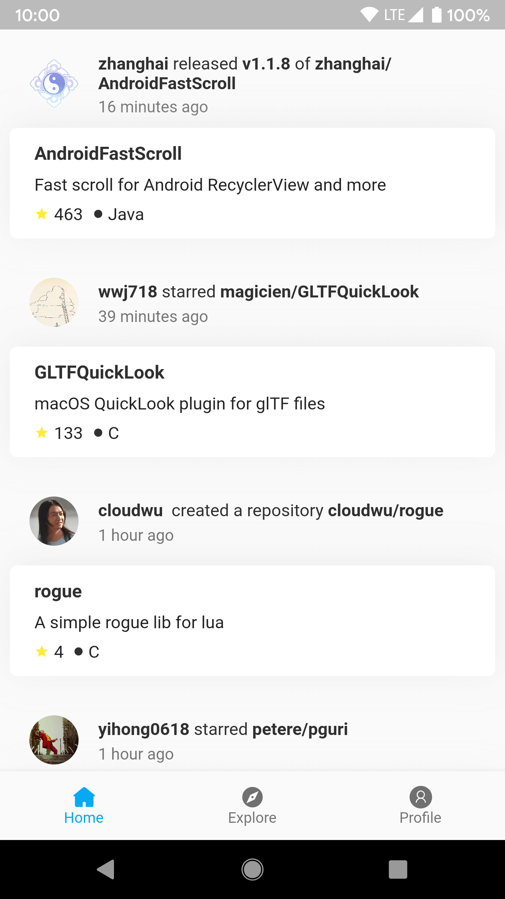
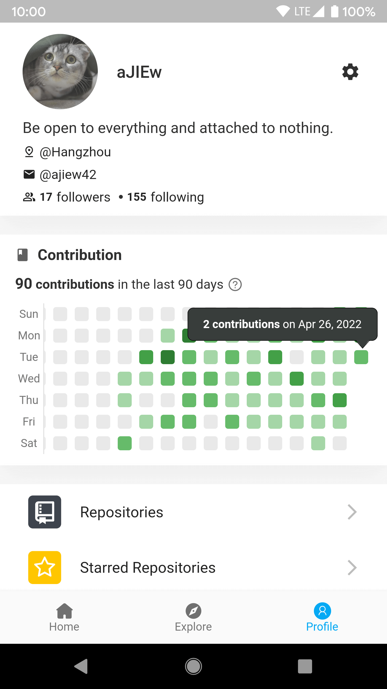
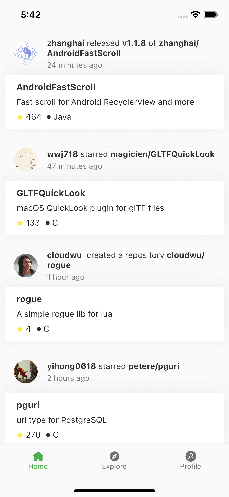
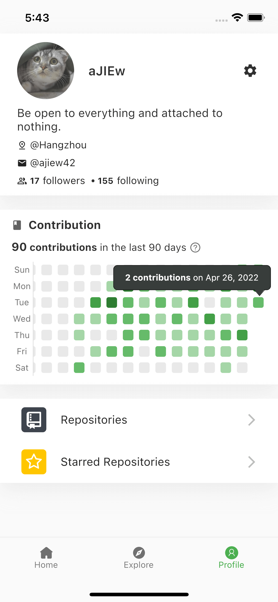

## jithub_flutter

Flutter 版本的 [Jithub](https://github.com/aJIEw/Jithub) 客户端。

### Android

|      Home        |      Explore      |       Profile      |
| :--------------: | :---------------: | :-----------------------: |
|  |  |  |

### iOS

|      Home        |      Explore      |       Profile      |
| :--------------: | :---------------: | :-----------------------: |
|  |  |  |

